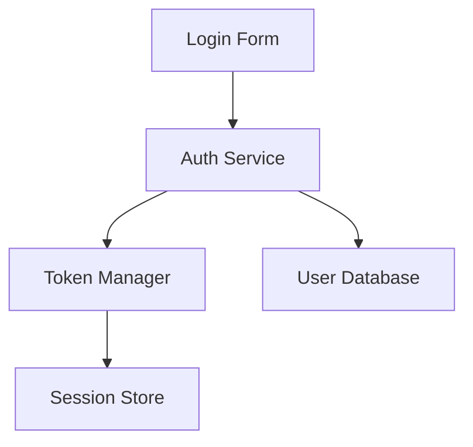

# Pimzino/claude-code-spec-workflow 深度研究报告

> **研究日期**: 2024-12-20
> **研究对象**: [Pimzino/claude-code-spec-workflow](https://github.com/Pimzino/claude-code-spec-workflow)
> **研究目的**: 提取核心架构、工作流程、最佳实践，为 SoloDevFlow 2.0 提供借鉴

---

## 一、项目概述

### 1.1 基本信息

| 项目 | 信息 |
|------|------|
| **项目名称** | claude-code-spec-workflow |
| **作者** | Pimzino |
| **GitHub Star** | 3.2k+ |
| **GitHub Fork** | 234 |
| **最新版本** | 2.1.5（NPM，2024-12-18更新） |
| **开发状态** | **已迁移到 MCP 版本**（spec-workflow-mcp） |
| **兼容性** | 原版仅支持 Claude Code；MCP版支持 Cursor、Continue、OpenCode 等 |

### 1.2 项目定位

**核心价值主张**：
> Automated workflows for Claude Code. Features spec-driven development for new features (Requirements → Design → Tasks → Implementation) and streamlined bug fix workflow for quick issue resolution (Report → Analyze → Fix → Verify).

**解决的核心问题**：
1. **上下文丢失**：长对话导致 Claude 遗忘原始需求
2. **低质量输出**：vague prompts → vague results
3. **缺乏结构**：缺少系统化开发流程
4. **重复劳动**：手动维护文档与代码一致性

**设计理念**：
- Spec 是"单一事实来源"（Single Source of Truth）
- AI 参考规格文档，自我校验，做出智能决策
- 结构化工作流 > 一次性 Prompt

---

## 二、核心架构分析

### 2.1 目录结构

```
your-project/
├── .claude/
│   ├── commands/        # 14+ slash commands + 自动生成
│   ├── steering/        # 持久化上下文文档
│   │   ├── product.md   # 产品愿景、业务逻辑
│   │   ├── tech.md      # 技术栈、架构决策
│   │   └── structure.md # 项目结构、代码组织
│   ├── templates/       # 文档模板
│   ├── specs/           # 生成的规格文档
│   │   └── {spec-name}/ # 每个功能一个目录
│   │       ├── requirements.md
│   │       ├── design.md
│   │       ├── tasks.md
│   │       └── logs/    # 实现日志
│   ├── bugs/            # Bug 工作流
│   │   └── {bug-name}/
│   │       ├── report.md
│   │       ├── analysis.md
│   │       ├── fix.md
│   │       └── verify.md
│   └── agents/          # AI Agents（可选）
```

### 2.2 三层架构设计

#### Layer 1: Steering Documents（持久化上下文）
- **目的**：作为项目的"宪法"，指导所有 AI 行为
- **内容**：
  - `product.md`：产品愿景、业务规则、用户场景
  - `tech.md`：技术栈、架构模式、技术约束
  - `structure.md`：目录规范、命名约定、代码组织
- **特点**：
  - 跨 Session 持久化
  - 所有 Agent 共享
  - 减少上下文漂移

#### Layer 2: Spec Documents（功能规格）
- **Requirements**：WHAT to build
  - 使用 EARS 格式（WHEN/IF/THEN 模式）
  - 可测试的验收标准
  - 消除需求歧义
- **Design**：HOW to build
  - 技术架构（Mermaid 图）
  - 组件关系、数据流、API 接口
  - 状态管理方案
- **Tasks**：WHEN/Order to implement
  - 原子化任务分解
  - 依赖关系明确
  - TDD 测试用例

#### Layer 3: Implementation（执行层）
- 按 Tasks 顺序系统执行
- 每步验证需求
- 记录实现日志

### 2.3 Token 优化架构

**问题**：重复读取文档导致 Token 浪费

**解决方案**：三级优化命令

| 命令 | 功能 | 应用场景 | Token 节省 |
|------|------|----------|-----------|
| `get-steering-context` | 批量加载所有 steering 文档 | 所有 Agent 启动时 | 60-80% |
| `get-spec-context` | 批量加载当前 Spec（Req+Design+Tasks） | Spec 执行时 | 60-80% |
| `get-template-context` | 批量加载模板（可按类型过滤） | 生成新文档时 | 60-80% |

**智能缓存策略**：
- Session 级缓存（文件变更时自动失效）
- 高冗余文档（steering/specs/templates）→ 批量加载
- 低冗余文档（bug reports）→ 直接读取
- 兜底机制：优化不可用时降级为 `get-content`

### 2.4 Agent 架构

#### 主 Agent
- 加载完整上下文（Steering + Full Spec + Task Details）
- 负责任务协调和决策

#### 子 Agent（可选）
- `spec-requirements-validator`：校验需求文档
- `spec-design-validator`：校验设计文档
- `spec-task-validator`：校验任务分解
- `spec-task-executor`：执行具体任务

**委托策略**：
- 主 Agent 传递**选择性上下文**（仅 Steering + Req + Design，不含 Tasks）
- 子 Agent 专注单一职责
- 避免重复加载

**可选性**：
- Agents 是增强功能，非必需
- 所有功能有内置 fallback

---

## 三、工作流程详解

### 3.1 新功能开发流程

```
Requirements → Design → Tasks → Implementation
```

#### Phase 1: Requirements（需求定义）

**触发命令**：
```bash
/spec-create user-authentication "Secure login system"
```

**AI 行为**：
1. 加载 Steering Documents（`get-steering-context`）
2. 与用户对话，挖掘需求细节
3. 生成 `requirements.md`（使用 EARS 格式）
4. 输出验收标准

**产出示例**（EARS 格式）：
```markdown
## Functional Requirements

**FR-001: User Login**
- WHEN user enters valid credentials
- THEN system authenticates and redirects to dashboard

**FR-002: Password Reset**
- IF user forgets password
- WHEN user requests reset
- THEN system sends reset link via email
```

**推荐模型**：Claude Opus 4（更强的理解和文档生成能力）

#### Phase 2: Design（技术设计）

**AI 行为**：
1. 读取 Requirements + Steering
2. 生成技术架构（Mermaid 图）
3. 定义组件接口、数据流
4. 输出 `design.md`

**产出示例**：
```markdown
## Architecture



## Components
- **AuthService**: Handles authentication logic
- **TokenManager**: JWT generation and validation
- **SessionStore**: Redis-based session management
```

#### Phase 3: Tasks（任务分解）

**AI 行为**：
1. 读取 Requirements + Design
2. 分解为原子化任务
3. 定义依赖关系
4. 生成测试用例（TDD）
5. 输出 `tasks.md`

**产出示例**：
```markdown
## Task Breakdown

**Task 1: Setup Authentication Middleware**
- Dependencies: None
- Acceptance Criteria:
  - Middleware validates JWT tokens
  - Returns 401 for invalid tokens
- Test Cases:
  - Valid token → next()
  - Invalid token → 401 error
  - Expired token → 401 error

**Task 2: Implement Login Endpoint**
- Dependencies: Task 1
- Acceptance Criteria:
  - Validates credentials against database
  - Generates JWT on success
...
```

#### Phase 4: Implementation（系统执行）

**触发命令**：
```bash
/spec-execute 1 user-authentication
# 或逐任务执行
/user-authentication-task-1
/user-authentication-task-2
```

**AI 行为**：
1. 加载完整上下文（`get-spec-context`）
2. 按依赖顺序执行任务
3. 每步验证需求（requirements validation）
4. 记录实现日志
5. 运行测试

**推荐模型**：Claude Sonnet 4（更快、更经济）

**实现日志示例**：
```markdown
## Implementation Log

**Task 1 - Completed**
- Files Modified: `src/middleware/auth.js`
- Tests Added: `tests/middleware/auth.test.js`
- Test Result: ✅ All 5 tests passed
- Code Stats: +45 lines

**Task 2 - In Progress**
...
```

### 3.2 Bug 修复流程

```
Report → Analyze → Fix → Verify
```

#### Phase 1: Report（问题报告）

**触发命令**：
```bash
/bug-create login-timeout "Users experiencing timeout on login"
```

**产出**：
```markdown
## Bug Report

**Bug ID**: login-timeout
**Severity**: High
**Reported**: 2024-12-20
**Description**: Users experiencing timeout on login after 5 seconds

**Reproduction Steps**:
1. Navigate to /login
2. Enter valid credentials
3. Click "Login"
4. Timeout occurs after 5s

**Expected Behavior**: Login completes within 2s
**Actual Behavior**: Request times out
```

#### Phase 2: Analyze（根因分析）

**触发命令**：
```bash
/bug-analyze
```

**AI 行为**：
1. 读取 bug report
2. 搜索相关代码
3. 分析日志/错误堆栈
4. 提出假设

**产出**：
```markdown
## Root Cause Analysis

**Hypothesis**: Database query missing index on `users.email`

**Evidence**:
- Query execution time: 4.8s (logs/db.log)
- Table scan detected (EXPLAIN output)

**Proposed Fix**:
- Add index on `users.email` column
- Optimize query to use prepared statements
```

#### Phase 3: Fix（实施修复）

**触发命令**：
```bash
/bug-fix
```

**AI 行为**：
1. 按分析结果实施修复
2. 添加测试用例（防止回归）
3. 记录变更

**产出**：
```markdown
## Fix Implementation

**Changes**:
- Added index: `CREATE INDEX idx_users_email ON users(email)`
- Optimized query: Use prepared statement

**Tests Added**:
- `test_login_performance_under_load()`
- Assert: Login completes < 2s with 100 concurrent users
```

#### Phase 4: Verify（验证修复）

**触发命令**：
```bash
/bug-verify
```

**AI 行为**：
1. 运行测试套件
2. 验证原问题已解决
3. 检查无副作用
4. 生成验证报告

**产出**：
```markdown
## Verification Report

**Test Results**: ✅ All tests passed
**Performance**: Login time reduced from 4.8s → 0.3s
**Side Effects**: None detected
**Status**: ✅ Ready for deployment
```

---

## 四、Slash Commands 完整清单

### 4.1 Setup Commands

| 命令 | 功能 | 使用场景 |
|------|------|----------|
| `/spec-steering-setup` | 创建 product.md, tech.md, structure.md | 项目初始化 |

### 4.2 Feature Development Commands

| 命令 | 功能 | 参数 |
|------|------|------|
| `/spec-create` | 创建新功能规格 | `{spec-name} "description"` |
| `/spec-execute` | 执行指定任务 | `{task-id} {spec-name}` |
| `/spec-status` | 查看规格执行状态 | `{spec-name}` |
| `/{spec-name}-task-{n}` | 执行指定任务（自动生成） | - |

### 4.3 Bug Workflow Commands

| 命令 | 功能 | 参数 |
|------|------|------|
| `/bug-create` | 创建 Bug 报告 | `{bug-name} "description"` |
| `/bug-analyze` | 分析根本原因 | - |
| `/bug-fix` | 实施修复 | - |
| `/bug-verify` | 验证修复效果 | - |

### 4.4 Context Optimization Commands

| 命令 | 功能 | 说明 |
|------|------|------|
| `get-steering-context` | 批量加载 steering 文档 | 内部使用 |
| `get-spec-context` | 批量加载当前 Spec | 内部使用 |
| `get-template-context` | 批量加载模板 | 可选参数：`spec`/`bug`/`steering` |

**注意**：Context 优化命令通常由 Agent 内部调用，用户无需手动执行。

---

## 五、CLAUDE.md 配置分析

### 5.1 配置理念

Pimzino 项目的 CLAUDE.md 遵循**最小化 + 渐进式披露**原则：

| 原则 | 说明 | 体现 |
|------|------|------|
| **Universal Applicability** | 仅包含普遍适用的指令 | 不写"如何设计数据库"（仅适用某场景） |
| **Progressive Disclosure** | 告诉 AI 如何找信息，而非直接给所有信息 | "读取 steering/ 了解架构" vs 直接写架构 |
| **Modular Context** | 分层管理上下文 | Steering（全局）+ Spec（功能）+ Tasks（任务） |

### 5.2 推测的 CLAUDE.md 结构

由于无法直接访问 GitHub，基于搜索结果和最佳实践，推测结构如下：

```markdown
# Project Context

## Workflow Overview
This project follows spec-driven development:
- Requirements → Design → Tasks → Implementation (for features)
- Report → Analyze → Fix → Verify (for bugs)

## Key Principles
1. Always load steering documents via `get-steering-context` at session start
2. Never implement before completing requirements and design
3. Use EARS format for requirements
4. Generate Mermaid diagrams for architecture

## File Locations
- Steering docs: `.claude/steering/`
- Spec docs: `.claude/specs/{spec-name}/`
- Bug docs: `.claude/bugs/{bug-name}/`
- Templates: `.claude/templates/`

## Commands Available
Use `/spec-create` to start new features
Use `/bug-create` to track bugs
See `.claude/commands/` for full list

## Context Optimization
- Use `get-steering-context` instead of reading individual files
- Use `get-spec-context` when working on specs
- System will auto-fallback to `get-content` if optimization unavailable
```

### 5.3 与 SoloDevFlow 的对比

| 维度 | Pimzino | SoloDevFlow 2.0 |
|------|---------|-----------------|
| **长度** | 推测 <100 行 | 93 行（CLAUDE.md） |
| **结构** | 流程概述 + 原则 + 位置 | 阶段 + 行为规则 + 机制 |
| **详细规范** | 分散在 steering/ 和 templates/ | 集中在 `docs/协作规范.md` |
| **上下文管理** | Steering Documents（持久化） | `.flow/state.json`（状态快照） |
| **渐进式披露** | 通过 steering 引用 | 通过 `协作规范.md` 引用 |

---

## 六、最佳实践总结（重点）

### 6.1 核心洞察

#### 1. Spec 是"单一事实来源"
**研究表明**：
> 1 iteration with structure ≈ 8 iterations with unstructured prompts

**为什么有效**：
- AI 有明确参考点，减少猜测
- 需求变更时，更新 Spec 即可重新生成
- 代码可溯源到 Task → Design → Requirements

#### 2. 分离"生成"与"执行"的模型选择
**最佳实践**：
- **生成 Spec**：使用 Claude Opus 4（更强的理解和文档能力）
- **执行实现**：使用 Claude Sonnet 4（更快、更经济）

**原理**：
- Spec 生成是"一次性投资"，质量优先
- 实现是"重复劳动"，速度优先

#### 3. Token 优化的本质是"避免重复读取"
**策略分层**：
- **高冗余文档**（Steering/Specs/Templates）→ 批量加载 + 缓存
- **低冗余文档**（Bug Reports）→ 直接读取
- **兜底机制**：优化失败时降级为单文件读取

**效果**：
- 60-80% Token 节省
- 更快的 Agent 响应
- 降低 API 成本

#### 4. EARS 格式消除需求歧义
**传统需求**：
> "用户可以登录系统"

**EARS 格式**：
> - WHEN user enters valid credentials
> - THEN system authenticates and redirects to dashboard
> - IF credentials invalid
> - THEN system displays error message

**优势**：
- 可测试（条件明确）
- 无歧义（触发条件清晰）
- AI 易理解（结构化）

#### 5. Mermaid 图作为"设计语言"
**为什么用图**：
- 人类理解快（视觉化）
- AI 生成准（结构化）
- 易维护（纯文本）

**典型场景**：
- 组件关系图（architecture）
- 数据流图（data flow）
- 状态机图（state transitions）

#### 6. 任务分解遵循 TDD
**模式**：
```
Task → Acceptance Criteria → Test Cases → Implementation
```

**好处**：
- 测试先行，防止偏离
- 每步可验证
- 快速发现集成问题

### 6.2 适用场景

| 场景 | 适合 Spec-Driven | 适合 Vibe-Coding |
|------|------------------|------------------|
| 项目周期 | > 3 天 | < 3 天 |
| 团队规模 | 多人协作 | 个人探索 |
| 项目类型 | 新项目 | 现有大型代码库 |
| 需求清晰度 | 复杂、模糊 | 简单、明确 |

### 6.3 局限性

#### 1. Double Code Review
- Spec 中已有伪代码
- 最终实现也需 Review
- 时间成本翻倍？

**缓解策略**：
- Spec 不写实现细节，只写接口和逻辑
- Review 重点放在架构层（Spec）而非细节层（Code）

#### 2. False Sense of Security
- AI 不总按 Spec 执行
- 需人工验证关键步骤

**缓解策略**：
- 使用 Validator Agents
- 增加测试覆盖率
- 关键节点人工审批

#### 3. 对大型代码库效果递减
- Spec 难以覆盖所有遗留代码
- 更新 Spec 成本高

**缓解策略**：
- 仅对新模块使用 Spec-Driven
- 旧代码逐步补 Spec

---

## 七、与 SoloDevFlow 的对比分析

### 7.1 相似点

| 维度 | Pimzino | SoloDevFlow 2.0 | 一致性 |
|------|---------|-----------------|--------|
| **阶段化流程** | Req → Design → Tasks → Impl | 需求 → 设计 → 实现 → 验证 | ✅ 高度一致 |
| **文档驱动** | Spec 作为 SSOT | PRD + 设计文档 | ✅ 一致 |
| **上下文持久化** | Steering Documents | state.json | ✅ 目的一致，形式不同 |
| **AI 行为规范** | CLAUDE.md | CLAUDE.md + 协作规范.md | ✅ 一致 |
| **渐进式披露** | Steering 引用 | 协作规范.md 引用 | ✅ 一致 |

### 7.2 差异点

| 维度 | Pimzino | SoloDevFlow 2.0 | 优劣分析 |
|------|---------|-----------------|----------|
| **上下文结构** | 分层（Steering/Spec/Tasks） | 扁平（state.json） | Pimzino 更模块化，但复杂度高 |
| **状态管理** | 隐式（文档状态） | 显式（state.json） | SoloDevFlow 更清晰 |
| **灵光机制** | 无 | spark-box.md | SoloDevFlow 独有 |
| **影响分析** | 无明确机制 | 内置影响分析流程 | SoloDevFlow 更严谨 |
| **文档债务** | 无 | pending-docs.md | SoloDevFlow 更实用 |
| **Token 优化** | 批量加载 + 缓存 | 无优化 | Pimzino 更高效 |
| **Agent 架构** | 主-子 Agent 委托 | 无 Agent | Pimzino 更自动化 |
| **人类审批** | 每阶段审批（MCP 版） | 每阶段审批 | 一致 |
| **模型选择** | Opus（Spec）+ Sonnet（Impl） | 未指定 | Pimzino 更经济 |

### 7.3 关键差异：Philosophy

| 维度 | Pimzino | SoloDevFlow |
|------|---------|-------------|
| **核心隐喻** | "规格是宪法" | "流程是护栏" |
| **优化重点** | Token 效率、自动化 | 人类认知负担、输入捕获 |
| **适用人群** | 熟悉规格编写的开发者 | 需要结构但不想写规格的独立开发者 |
| **自动化程度** | 高（fire-and-forget） | 中（人类主导决策） |

---

## 八、可借鉴点（针对 SoloDevFlow）

### 8.1 立即可借鉴

#### 1. Token 优化机制
**借鉴方案**：
```markdown
## 新增命令（脚本实现）
- `npm run load-context` → 批量输出 state.json + 协作规范摘要
- AI 在对话开始时调用，减少重复读取
```

**预期效果**：
- 减少 50%+ 的 state.json 读取次数
- 加快 AI 启动速度

#### 2. EARS 格式需求
**借鉴方案**：
- 更新 `迭代PRD模板`，增加 EARS 格式示例
- AI 引导人类按 WHEN/IF/THEN 描述需求

**预期效果**：
- 需求更可测试
- 减少实现阶段的需求理解偏差

#### 3. Mermaid 架构图
**借鉴方案**：
- 设计阶段强制输出架构图
- 模板中增加 Mermaid 示例

**预期效果**：
- 设计评审更高效
- 实现时参考更清晰

#### 4. 模型选择策略
**借鉴方案**：
- 更新 CLAUDE.md，明确：
  - 需求/设计阶段 → 优先 Claude Opus 4
  - 实现阶段 → 优先 Claude Sonnet 4

**预期效果**：
- 降低 30%+ API 成本
- 保持高质量 Spec

### 8.2 需适配后借鉴

#### 1. Steering Documents
**Pimzino 方案**：
- product.md / tech.md / structure.md
- 持久化、全局共享

**SoloDevFlow 适配**：
- 复用现有 `产品PRD.md`（对应 product.md）
- 新增 `技术架构.md`（对应 tech.md）
- 新增 `项目结构.md`（对应 structure.md）
- AI 在每次对话时加载（类似 state.json）

**优势**：
- 减少重复描述技术栈
- 新迭代自动继承技术约束

#### 2. Task Breakdown（任务分解）
**Pimzino 方案**：
- 独立的 `tasks.md`
- 依赖关系明确
- 自动生成执行命令

**SoloDevFlow 适配**：
- 在 `迭代X-设计.md` 增加"任务分解"章节
- 格式：
  ```markdown
  ## 任务分解

  **Task 1**: Setup Database Schema
  - Dependencies: None
  - Acceptance Criteria: ...
  - Test Cases: ...

  **Task 2**: Implement Auth Middleware
  - Dependencies: Task 1
  - Acceptance Criteria: ...
  ```

**优势**：
- 实现阶段有明确路径
- 减少"从哪开始"的犹豫

### 8.3 暂不借鉴

#### 1. Sub-Agent 架构
**原因**：
- SoloDevFlow 定位是"人主导"，高度自动化违背理念
- 增加复杂度，维护成本高

**保留可能性**：
- 未来迭代3+，可引入 Validator Agent（仅校验，不执行）

#### 2. 完全自动化的 Bug Workflow
**原因**：
- SoloDevFlow 强调人类验收
- 自动 Fix 风险高

**折中方案**：
- 借鉴 Bug 文档结构（Report/Analyze/Fix/Verify）
- 但保持人类审批节点

---

## 九、创新点与独特价值

### 9.1 Pimzino 的独特创新

| 创新点 | 说明 | 价值 |
|--------|------|------|
| **Universal Context Sharing** | 三级优化命令（steering/spec/template） | 60-80% Token 节省 |
| **Session-Based Caching** | 文件变更自动失效 | 兼顾效率与一致性 |
| **Hierarchical Agent Context** | 主 Agent 完整上下文，子 Agent 选择性上下文 | 避免重复加载 |
| **Built-in Approval Gates** | MCP 版内置审批流程 | 正式化人机协作 |
| **Real-Time Dashboard** | Web + VSCode Extension | 可视化项目进度 |
| **EARS Format Enforcement** | 强制可测试需求 | 提升需求质量 |

### 9.2 与竞品对比

| 工具 | 自动化程度 | UI | 人机协作模式 | 可追溯性 |
|------|-----------|----|--------------| ---------|
| **Pimzino Spec-Workflow** | 高（fire-and-forget） | Dashboard + CLI | 审批门控（Built-in） | 高（Code → Task → Design → Req） |
| **GitHub Spec Kit** | 中（Step-by-step） | CLI | 人工 Review | 中 |
| **cc-sdd（gotalab）** | 中 | CLI | 人工引导 | 中 |

---

## 十、实际应用案例

### 10.1 VR Hand-Tracking 项目

**场景**：开发 VR 手势识别功能

**流程**：
1. `/spec-create vr-hand-tracking "Implement hand gesture recognition"`
2. AI 生成 Requirements（定义手势类型、识别精度）
3. AI 生成 Design（传感器数据流 + 识别算法架构）
4. AI 分解 Tasks（校准、手势识别、UI 绑定）
5. `/spec-execute 1 vr-hand-tracking`

**结果**：
- **First-run success**：代码一次运行成功，无需调试
- **Complete implementation**：桌面模式 + VR 模式均正常工作
- **Production-ready**：包含错误处理、日志记录

**关键成功因素**：
- Spec 阶段明确了"双模式支持"（Desktop fallback）
- Design 阶段预先设计了错误处理路径
- Tasks 包含完整测试用例

### 10.2 电商网站多功能开发

**场景**：实现用户注册、产品目录、购物车、结账流程

**流程**：
1. 为每个功能创建独立 Spec
2. 按依赖顺序执行（用户注册 → 产品目录 → 购物车 → 结账）
3. 每个 Spec 完成后验证集成

**好处**：
- 功能隔离，测试独立
- 进度可追踪（Dashboard 显示完成度）
- 需求变更只影响对应 Spec

---

## 十一、关键链接

### 11.1 主项目
- [GitHub - claude-code-spec-workflow](https://github.com/Pimzino/claude-code-spec-workflow)
- [NPM - @pimzino/claude-code-spec-workflow](https://www.npmjs.com/package/@pimzino/claude-code-spec-workflow)

### 11.2 MCP 版本（推荐）
- [GitHub - spec-workflow-mcp](https://github.com/Pimzino/spec-workflow-mcp)
- [NPM - @pimzino/spec-workflow-mcp](https://www.npmjs.com/package/@pimzino/spec-workflow-mcp)
- [VSCode Extension - Spec Workflow MCP](https://marketplace.visualstudio.com/items?itemName=Pimzino.spec-workflow-mcp)

### 11.3 社区资源
- [深度分析 - Beyond the Hype](https://skywork.ai/skypage/en/pimzino-spec-workflow-mcp-server/1978716587922411520)
- [使用指南 - Claude Code Spec Workflow: Transform Ideas to Code](https://joshuaopolko.com/claude-code-specification-workflow-mcp/)
- [Spec-Driven Development 理念 - Spec-Driven Development: Designing Before You Code](https://medium.com/@dave-patten/spec-driven-development-designing-before-you-code-again-21023ac91180)

### 11.4 相关工具
- [GitHub Spec Kit（官方工具）](https://github.com/github/spec-kit)
- [cc-sdd by gotalab](https://github.com/gotalab/cc-sdd)
- [cc-sdd by pdoronila](https://github.com/pdoronila/cc-sdd)

---

## 十二、总结

### 12.1 核心价值

Pimzino/claude-code-spec-workflow 的核心价值在于：

1. **系统化**：将开发流程固化为 Requirements → Design → Tasks → Implementation
2. **可追溯**：Code 可溯源到具体 Task、Design、Requirement
3. **高效化**：通过 Token 优化和模型选择策略，降低成本 60-80%
4. **自动化**：通过 Agent 架构和 Slash Commands，减少手动操作

### 12.2 对 SoloDevFlow 的启示

| 维度 | 启示 |
|------|------|
| **Token 优化** | 引入批量上下文加载机制 |
| **需求格式** | 采用 EARS 格式提升可测试性 |
| **架构可视化** | 强制输出 Mermaid 图 |
| **模型选择** | Opus（Spec）+ Sonnet（Impl）降低成本 |
| **任务分解** | 增加独立的 Task Breakdown 章节 |
| **上下文分层** | 引入 Steering Documents 概念 |

### 12.3 不适合直接复制的部分

| 部分 | 原因 |
|------|------|
| **高度自动化** | 违背 SoloDevFlow"人主导决策"原则 |
| **Sub-Agent 架构** | 增加复杂度，维护成本高 |
| **完全自动化 Bug Fix** | 风险高，需人类验收 |

### 12.4 下一步行动建议

**立即行动**（低成本、高收益）：
1. 更新 CLAUDE.md，增加模型选择策略
2. 更新 PRD 模板，增加 EARS 格式示例
3. 设计阶段增加 Mermaid 图要求

**中期规划**（需设计）：
1. 设计 Token 优化方案（`npm run load-context`）
2. 设计 Steering Documents 结构（技术架构.md、项目结构.md）
3. 增加任务分解章节模板

**长期探索**（需验证）：
1. 引入 Validator Agent（仅校验）
2. 开发可视化 Dashboard（可选）

---

**研究报告完成时间**：2024-12-20
**版本**：v1.0
**研究者**：Claude Opus 4.5（协助 SoloDevFlow 2.0 项目）
